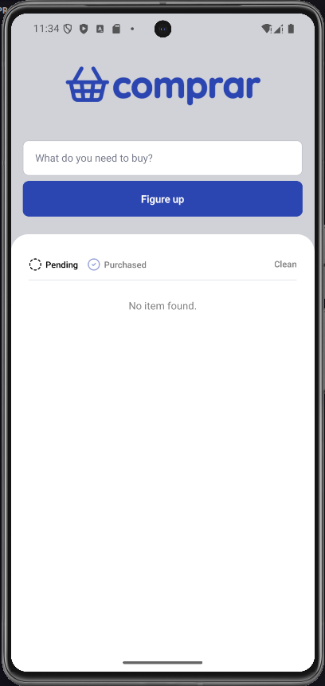

<p align="center" >
  
</p>

<p align="center">
  
  
  
  
  
  
  
</p>

<p align="center">
  <a href="#-technologies">Technologies</a>&nbsp;&nbsp;&nbsp;|&nbsp;&nbsp;&nbsp;
  <a href="#-project">Project</a>&nbsp;&nbsp;&nbsp;|&nbsp;&nbsp;&nbsp;
  <a href="#-layout">Layout</a>&nbsp;&nbsp;&nbsp;|&nbsp;&nbsp;&nbsp;
  <a href="#-license">License</a>
</p>

<p align="center">
  
</p>

<br>

<p align="center">
  
</p>

## 🚀 Technologies

This project was developed with the following technologies:

- **React Native**: Framework for building native mobile apps using React
- **Expo**: Platform for universal React applications
- **TypeScript**: Typed superset of JavaScript for better development experience
- **AsyncStorage**: React Native module for persistent key-value storage
- **Lucide React Native**: Icon library for consistent and beautiful icons
- **React Native SVG**: Library for rendering SVG images

## 💻 Project

Comprar is a simple and intuitive mobile shopping list application built with React Native and Expo. It allows users to create, manage, and organize their shopping items efficiently. Users can add new items, mark them as completed or pending, filter items by status, and clear all items when needed. The app uses local storage to persist data across app sessions.

## 💻 How to run

```bash
# Clone the repository
git clone https://github.com/filipebteixeira98/comprar.git

# Access the project folder
cd comprar

# Install the dependencies
npm install

# Run the project
npm run start
```

## 🫶 Contributing

Contributions are welcome! Please feel free to submit a Pull Request.

## 📝 License

This project is under the MIT license.

<p align="center">
  Made with ♥ by me
</p>
